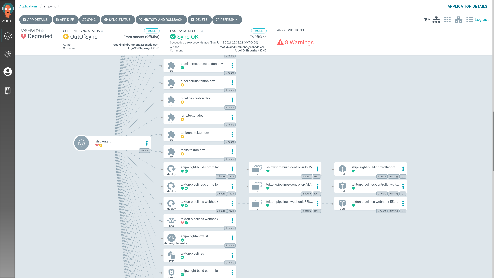

# Shipwright in ArgoCD, with Trivy scanning

Build images on Kubernetes! With ArgoCD!

Work in progress!

# Known issues

The gatekeeper constraint template and constraint don't auto-deploy in ArgoCD, and they block the rest of shipwright.
If you manually `kubectl apply -f` them, then everything boots up.

# TODO

Take a look at writing a custom BuildStrategy that uses ACR Build. E.g. like this github action

https://github.com/ams0/acr-task-github-action/blob/master/entrypoint.sh

I think this could take all the scary parts of building images out of our cluster, which is safer.
